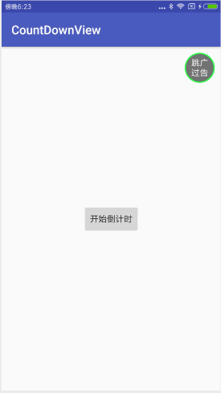

# CountDownView
###### 广告倒计时控件。
* * *

## 简介
一款简单易用的广告倒计时控件。

## 下载
###### 第一步：添加 JitPack 仓库到你项目根目录的 gradle 文件中。
```
allprojects {
    repositories {
        ...
        maven { url 'https://jitpack.io' }
    }
}
```
###### 第二步：添加这个依赖。
```
dependencies {
    compile 'com.github.kelinZhou:CountDownView:1.0.0'
}
```

## 效果图


## 使用
#### xml布局文件中使用。
```
<com.kelin.countdownview.CountDownView
    android:id="@+id/cd_view"
    android:layout_width="wrap_content"
    android:layout_height="wrap_content"
    app:duration="5000" <!--指定倒计时时长。默认为5000毫秒。-->
    android:text="跳过广告"<!--指定文本内容。默认为"跳过"。-->
    app:lineTextLength="2"<!--指定单行文字的长度，没有指定的话如果文本内容小于两位则默认为文本长度，否则为文本长度的一半。-->
    android:textSize="14sp"<!--指定字体大小。默认为14sp。-->
    android:textColor="#FFF"<!--指定字体颜色，默认为白色。-->
    app:progressBarWidth="2dp"<!--指定进度条宽度，默认为2dp。-->
    app:progressBarColor="#f0f4"<!--指定进度条颜色，默认为红色：#FF00-->
    app:progressBarMode="clockwiseFromExist"/><!--指定进度条模式，可以为：clockwiseFromNothing（顺时针从无到有）、clockwiseFromExist（顺时针从有到无）、anticlockwiseFromNothing（逆时针从无到有）、anticlockwiseFromExist（逆时针从有到无）-->
```
以上属性都可以在代码中设置，只是必须在start()方法调用前调用。

#### 代码中使用。
```
//找到倒计时控件设置监听并启动倒计时。
((CountDownView)findViewById(R.id.cd_view)).setOnFinishListener(new CountDownView.OnFinishListener() {
            @Override
            public void onFinish() {
                Toast.makeText(getApplicationContext(), "倒计时完毕！", Toast.LENGTH_SHORT).show();
            }
        }).start();
```


* * *
### License
```
Copyright 2016 kelin410@163.com

Licensed under the Apache License, Version 2.0 (the "License");
you may not use this file except in compliance with the License.
You may obtain a copy of the License at

    http://www.apache.org/licenses/LICENSE-2.0

Unless required by applicable law or agreed to in writing, software
distributed under the License is distributed on an "AS IS" BASIS,
WITHOUT WARRANTIES OR CONDITIONS OF ANY KIND, either express or implied.
See the License for the specific language governing permissions and
limitations under the License.
```
